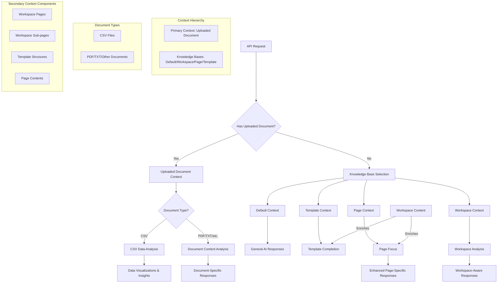

# AI Assistant Context Flow

## Context Model Description

The AI Assistant operates with a hierarchical context model:

### Primary Context: Uploaded Document

When a document is uploaded, it becomes the primary context:

1. **Uploaded Document Context**
   - Decision point: System determines if the uploaded file is CSV or another document type (PDF, TXT, etc.)
   - For CSV files:
     - Primary: Uploaded CSV file data
     - Behavior: AI Assistant analyzes the CSV data for visualizations and insights
   - For other document types:
     - Primary: Uploaded document content (PDF, TXT, etc.)
     - Behavior: AI Assistant processes and responds to queries about the specific document

### Knowledge Bases (When No Document is Uploaded)

If no document is uploaded, one of these becomes the active context:

2. **Default Context**
   - Behavior: AI Assistant provides general responses without specific contextual information

3. **Template Context**
   - Context: Selected template (e.g., "Product Metrics Template")
   - Enriched by: Workspace content when available
   - Behavior: AI Assistant guides template completion

4. **Page Context**
   - Context: Selected page being viewed/edited
   - Enriched by: Broader workspace content when available
   - Behavior: AI Assistant focuses on the page while leveraging related workspace information

5. **Workspace Context**
   - Context: Entire workspace content (pages, sub-pages)
   - Behavior: AI Assistant provides responses with awareness of the complete workspace knowledge repository
